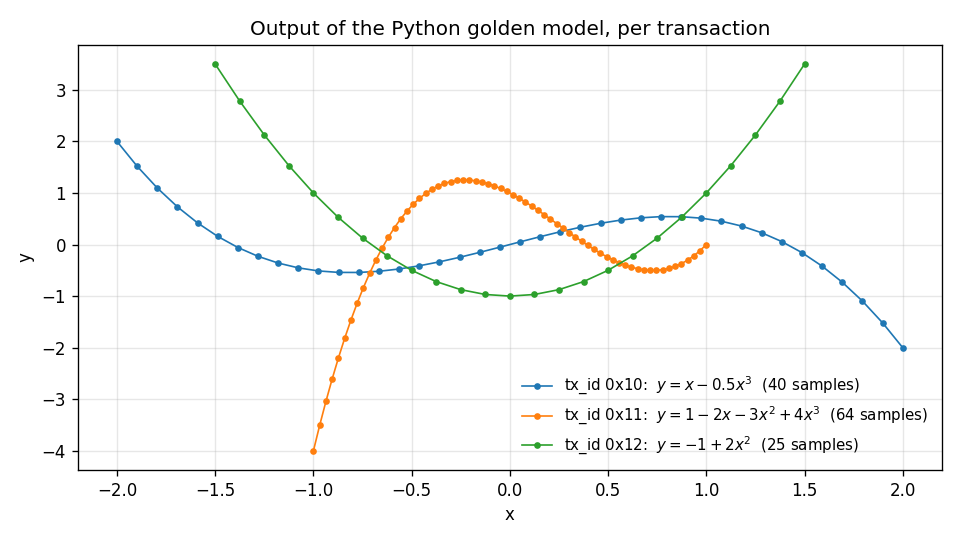

# Headers and the Golden Model

Before any hardware runs, the build generates the message headers and
writes the test transactions, with the responses a correct IP should send.

## The build script

The demo runs from a build script, `poly_build.py`, built on the
[waveflow build system](https://sdrangan.github.io/waveflow/docs/guide/build/).
It works like the one in the [AXI4-Streaming demo](../stream/python.md#the-build-script):
the build is a graph of steps, each declaring the files it consumes and
produces, and a step is skipped when nothing it depends on has changed.

Open a terminal, activate the [virtual environment](../../support/repo/package.md)
that has `waveflow`, and go to the demo:

~~~bash
cd hwdesign/demos/stream/poly
~~~

List the steps:

~~~bash
(env) python poly_build.py --list-steps
~~~

~~~text
poly_cpp
poly_hpp
tb_poly
run_tcl
schema_py
golden_py
timing_py
gen_include
pysim
plot_python
csim
verify_csim
csynth
cosim
verify_cosim
extract_vcd
timing_diagram
report
~~~

The first seven are the hand-written source files. The rest do the work,
in this graph:

~~~text
gen_include --+
pysim --------+-> csim -> verify_csim -> csynth -> cosim -> verify_cosim
      |                                                  -> extract_vcd -> timing_diagram
      +-> plot_python
                                                    (all of it) -> report
~~~

Run the graph up to a step with `--through <step>`. Other useful options:

| Option | What it does |
| --- | --- |
| `--list-steps-verbose` | what each step consumes and produces |
| `--status` | which steps are out of date, without running anything |
| `--force-step <step>` | re-run one step, and everything after it, even though nothing changed |
| `--force` | re-run everything |
| `--kernel poly32`, `poly64` or `general` | which version of the kernel to build (default `general`) |
| `--word-bw 32` or `64` | the stream word width, for the general kernel (the other two set their own) |
| `--live-output` | show Vitis's output as it runs, instead of saving it to `results/<stage>/vitis.log` |
| `--trange T0 T1` | the time window, in ns, for the timing diagram |

A step re-runs when a **file** it depends on has changed, not when an
option has. So when you change an option, force the step it belongs to.
For example, `--word-bw 64 --force-step csim` rebuilds everything from C
simulation on at the new width.

## Step 1: Generate the headers (`gen_include`)

~~~bash
(env) python poly_build.py --through gen_include
~~~

~~~text
gen_include:
    include
    RUNNING...
Generated 14 headers in include/
    PASSED
~~~

This fills `include/` from the schemas in `poly_schema.py`:

| File | What it is |
| --- | --- |
| `poly_cmd_hdr.h`, `poly_resp_hdr.h`, `poly_resp_ftr.h` | the three messages |
| `coeff_array.h`, `poly_error.h` | the types the messages are built from |
| `float32_array_utils.h` | packing arrays of float samples into stream words |
| `streamutils_hls.h`, `streamutils.cpp` | the AXI4-Stream word type and TLAST bookkeeping |
| `*_tb.h` | testbench-only additions, such as reading a message from a file |

Open `include/poly_cmd_hdr.h` and find the `PolyCmdHdr` struct. Its fields
are exactly the schema's, with the descriptions as comments, followed by
one packing method per interface and word width.

`include/` is generated, so it is not in git, and you should never edit
it. Change `poly_schema.py` instead: this step is stale whenever the
schemas change, and everything that compiles against the headers re-runs
after it.

## The golden model

`poly_golden.py` holds the test transactions and the model. The model is
**functional**: it says what each response should contain, not when it
should appear.

~~~python
def poly_eval(coeffs, x: np.ndarray) -> np.ndarray:
    """The reference model: Horner's rule in float32, in the kernel's order."""
    c = np.asarray(coeffs, dtype=np.float32)
    x = np.asarray(x, dtype=np.float32)
    y = np.full_like(x, c[3])
    for k in (2, 1, 0):
        y = y * x + c[k]
    return y
~~~

It computes in `float32` and in the kernel's order, Horner's rule from the
highest coefficient down. So a correct kernel matches it **bit for bit**,
for the same reason as in the [averaging filter](../stream/python.md#the-model).

There are three test transactions, with different polynomials and
different lengths:

~~~python
def test_transactions() -> list[Transaction]:
    return [
        Transaction(0x10, (0.0, 1.0, 0.0, -0.5),
                    np.linspace(-2.0, 2.0, 40, dtype=np.float32)),
        Transaction(0x11, (1.0, -2.0, -3.0, 4.0),
                    np.linspace(-1.0, 1.0, 64, dtype=np.float32)),
        Transaction(0x12, (-1.0, 0.0, 2.0, 0.0),
                    np.linspace(-1.5, 1.5, 25, dtype=np.float32)),
    ]
~~~

Sending several back to back matters. It checks that the kernel really
does take the coefficients from each command rather than keeping the
first one, and that it is ready for a new command after each response.
The odd length, 25, checks the last partly filled word when `WORD_BW=64`.

## Step 2: Write the vectors (`pysim`)

~~~bash
(env) python poly_build.py --through pysim
~~~

~~~text
pysim:
    RUNNING...
Wrote 3 transactions to vectors/ and their expected responses to results/golden/:
  txn 0: tx_id=0x10 coeffs=[0.0, 1.0, 0.0, -0.5] nsamp=40
  txn 1: tx_id=0x11 coeffs=[1.0, -2.0, -3.0, 4.0] nsamp=64
  txn 2: tx_id=0x12 coeffs=[-1.0, 0.0, 2.0, 0.0] nsamp=25
    PASSED
~~~

This writes two directories:

~~~text
vectors/                 what the testbench sends
    ntxn.txt             the number of transactions
    txn0_cmd_hdr.bin     transaction 0's command header
    txn0_samp_in.bin     transaction 0's input samples
    ...
results/golden/          what the testbench should get back
    txn0_resp_hdr.bin
    txn0_samp_out.bin
    txn0_resp_ftr.bin
    ...
~~~

Every file is a sequence of 32-bit words, packed with the schemas:
`PolyCmdHdr().write_uint32_file(...)` in Python, read back with the
generated `read_uint32_file` in the testbench. The testbench writes its
own responses under the same names, in `results/csim/` and
`results/cosim/`, so each can be compared file for file against
`results/golden/`.

## Step 3: Plot it (`plot_python`)

~~~bash
(env) python poly_build.py --through plot_python
~~~

This writes `results/poly_python.png`: each transaction's output against
its input, as the model computes it.

Three different cubics, one per command. The IP will be checked against
exactly these points.

---

Go to [Writing the Vitis Kernel](./vitis32.md)
