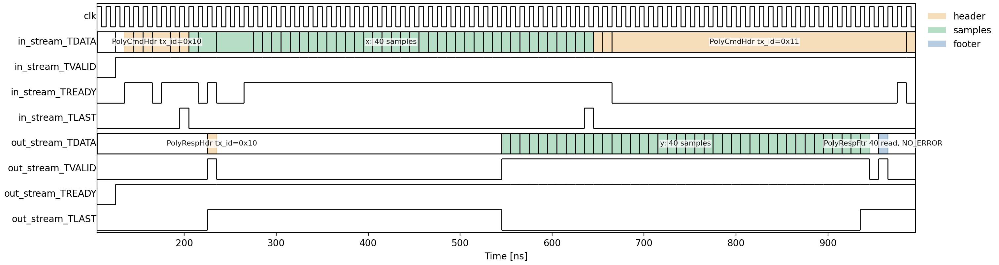
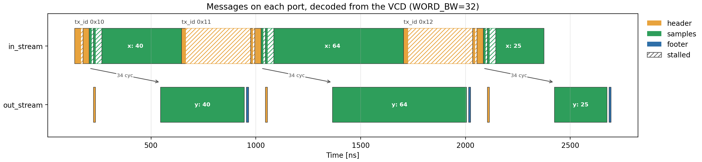

# Viewing the Timing Diagram

Co-simulation showed that the RTL answers every command correctly. This
page looks at *how* the messages move on the wires: where each one begins
and ends, how long a transaction takes, and where the stream waits.

Run everything below from `hwdesign/demos/stream/poly`, as before.

## Step 9: Extract a VCD file (`extract_vcd`)

~~~bash
(env) python poly_build.py --through extract_vcd
~~~

~~~text
extract_vcd:
    vcd\dump.vcd
    RUNNING...
VCD copied to ...\demos\stream\poly\vcd\dump.vcd
VCD has 14 signals.
    PASSED
~~~

This re-runs the RTL simulation with VCD logging switched on, exactly as
in the [AXI4-Streaming demo](../stream/timing.md#step-8-extract-a-vcd-file-extract_vcd).
The 14 signals are the clock, the reset, and six signals per stream:
TDATA, TVALID, TREADY, TLAST, TKEEP and TSTRB.

## Step 10: Decode and plot the messages (`timing_diagram`)

~~~bash
(env) python poly_build.py --through timing_diagram
~~~

~~~text
timing_diagram:
    RUNNING...
tx_id 0x10: 40 samples, latency 34 cycles, transaction 83 cycles (command header stalled 1)
tx_id 0x11: 64 samples, latency 34 cycles, transaction 138 cycles (command header stalled 32)
tx_id 0x12: 25 samples, latency 34 cycles, transaction 99 cycles (command header stalled 32)
    PASSED
~~~

### How the messages are decoded

On each port, a burst ends at a transfer with TLAST high. Every message
and every sample block is its own burst, so the bursts on the wires line
up one to one with the protocol:

~~~text
in_stream:   PolyCmdHdr | x          (per transaction)
out_stream:  PolyRespHdr | y | PolyRespFtr
~~~

The step walks each port's clock edges, collects the words that
transferred, and splits them at every TLAST. Then it unpacks each burst
with the **same schemas** the kernel's headers were generated from, for
example `PolyCmdHdr().deserialize(words, word_bw=32)`. That recovers every
message exactly as it crossed the port.

It then checks them. The commands on `in_stream` must be the test
vectors, and the responses on `out_stream` must be the model's. The step
fails otherwise. This is a third check against the model, after
`verify_csim` and `verify_cosim`, and it reads the values off the wires
rather than out of the testbench's files.

### One transaction, cycle by cycle

`results/timing_diagram.png` shows every port through transaction 0, with
each burst shaded by the message it carries:

Read it from left to right:

* **The command header** (orange, top) is six words: `tx_id`, the four
  coefficients, and `nsamp`. `in_stream_TLAST` pulses on its last word.
* **The response header** (orange, bottom) goes out almost at once, as the
  first samples arrive and long before any result is ready. It echoes
  `tx_id`, which is what lets a host match responses to commands.
* **The input samples** (green, top) follow the command, with TLAST on the
  40th. Near the start, `in_stream_TREADY` drops a few times while the
  kernel works through the header, sends its response header and starts
  the sample loop. After that, one sample transfers every cycle.
* **The output samples** (green, bottom) start 34 cycles after the input
  samples. That is the pipeline latency: the 30-cycle Horner datapath from
  the [synthesis report](./poly_cosim.md#the-pipeline), plus the register
  slices on the stream ports. Then one sample comes out every cycle, with
  TLAST on the last.
* **The footer** (blue) comes last: 40 samples read, `NO_ERROR`.
* **The next command header** has already arrived on `in_stream`. Its
  first word is accepted, and then `in_stream_TREADY` goes **low** and
  stays low for about 30 cycles. The kernel will not read the rest of it
  until it has finished transaction 0 and written the footer.

To look at a different stretch, give a window in ns and force the step to
run again:

~~~bash
(env) python poly_build.py --through timing_diagram --trange 900 1500 --force-step timing_diagram
~~~

### All three transactions

A cycle-by-cycle view of all three transactions would be unreadable.
`results/transactions.png` shows every burst instead, as a bar against
time, with each port on its own lane:

Solid bars are cycles where words moved. **Hatched** bars are cycles
inside a burst where nothing moved, because TVALID or TREADY was low.
The arrows mark the 34-cycle latency from each transaction's first input
sample to its first output sample.

The long hatched stretches are the most important thing in the figure.
Transactions 0x11 and 0x12 each have their command header waiting
about 32 cycles before the kernel accepts it. The host had the next
command ready, but the kernel was still draining the previous
transaction through its 34-cycle pipeline.

So the transactions **do not overlap**. Every transaction pays the full
pipeline fill and drain, about 70 cycles, on top of its samples. For
transaction 0x12, that is 99 cycles for 25 samples. Long transactions
spread that overhead thinly; short ones are dominated by it. Hiding it
would take a kernel that starts the next command while the last one's
samples are still in the pipeline, which is a later topic.

### The report

`results/stream_timing.json` has the measurements per transaction:

~~~json
{
  "tx_id": 17,
  "nsamp": 64,
  "cmd_hdr_words": 6,
  "cmd_hdr_stall_cycles": 32,
  "latency_cycles": 34,
  "samples_in_cycles": 68,
  "samples_out_cycles": 64,
  "transaction_cycles": 138
}
~~~

* `latency_cycles`: first sample in to first sample out.
* `samples_out_cycles`: first output sample to last. It equals `nsamp`,
  so the output never stalls.
* `transaction_cycles`: the command header's first word to the footer's
  last, the whole transaction as the host sees it.
* `cmd_hdr_stall_cycles`: the cycles the command header waited.

### Under the hood

The decoding and plotting live in `poly_timing.py`, and the step wires
them into the graph:

~~~python
@dataclass(kw_only=True)
class TimingDiagramStep(BuildStep):
    consumes = ["vcd", "py_vectors", "golden_dir", "timing_py"]
    produces = {
        "timing_diagram": Path("results/timing_diagram.png"),
        "transactions_plot": Path("results/transactions.png"),
        "stream_timing": Path("results/stream_timing.json"),
    }
~~~

It uses waveflow's `VcdParser`: `add_axiss_signals` finds each stream's
signals, including TLAST, and `extract_axis_bursts` returns the
TLAST-terminated bursts.

## Running the whole flow

Every step, in one command:

~~~bash
(env) python poly_build.py
~~~

It ends with a summary, also saved to `results/summary.json`:

~~~json
{
  "top": "poly",
  "word_bw": 32,
  "transactions": 3,
  "csim_verified": true,
  "cosim_verified": true,
  "cosim_max_abs_err": 0.0,
  "messages_on_wires_match": true,
  "latency_cycles": [34, 34, 34],
  "transaction_cycles": [83, 138, 99],
  "python_plot": "results/poly_python.png"
}
~~~

## What the build produced

| File | Step | What it is |
| --- | --- | --- |
| `include/` | `gen_include` | the generated message headers |
| `vectors/` | `pysim` | the commands the testbench sends |
| `results/golden/` | `pysim` | the responses the model expects |
| `results/poly_python.png` | `plot_python` | each transaction's polynomial, from the model |
| `results/csim/`, `results/cosim/` | `csim`, `cosim` | the responses the kernel sent, and `vitis.log` |
| `results/verify_csim.json`, `results/verify_cosim.json` | `verify_csim`, `verify_cosim` | kernel vs model, field by field |
| `results/csynth/poly_csynth.rpt` | `csynth` | the synthesis report |
| `vcd/dump.vcd` | `extract_vcd` | the ports' waveforms |
| `results/timing_diagram.png` | `timing_diagram` | transaction 0, cycle by cycle |
| `results/transactions.png` | `timing_diagram` | every message of every transaction |
| `results/stream_timing.json` | `timing_diagram` | latency and transaction length |
| `results/summary.json` | `report` | the verdicts and the timing in one place |

All of it is regenerated by the build and ignored by git. Delete
`include/`, `vectors/`, `results/`, `vcd/` and `poly_proj/` to start from
scratch.

## At 64 bits

At 64 bits, with `--kernel poly64` or `--word-bw 64`, every step runs the
same way, `timing_diagram` included. The decoder is unchanged: it passes
`word_bw=64` to the same schemas.

Two things look different on the wires:

* **Two samples per word.** Each 64-bit word carries two float32 samples,
  the first in the low 32 bits. A block of 40 samples is 20 transfers, so
  `samples_out_cycles` is `nsamp / 2`.
* **The command header is four words, not three.** Its fields would fit in
  three 64-bit words, but an array always starts on a fresh word and the
  field after it does too:

  ~~~text
  word 0:  tx_id
  word 1:  coeffs[0] | coeffs[1]
  word 2:  coeffs[2] | coeffs[3]
  word 3:  nsamp
  ~~~

  This is waveflow's word layout rule. It keeps the array's elements
  packed evenly into words, so the kernel can move one word per clock.

The three transactions take 61, 103 and 84 cycles, against 83, 138 and 99
at 32 bits. The pipeline latency is still 34 cycles: it is the datapath's
depth, not the port's width.

## When a step fails

* **`gen_include` fails.** A schema in `poly_schema.py` is invalid. The
  message names it.
* **`Vitis HLS stage 'csim' failed`, with `: error:` lines.** A compile
  error. The lines name the file and line. An error about an
  "out-of-line definition" means a `_tb.h` header was included after
  `poly.hpp`; see [the testbench](./poly_csim.md#the-testbench).
* **`... failed`, with `FAIL` lines.** The testbench's own check failed.
  The lines name the transaction.
* **`verify_csim` or `verify_cosim` failed.** The message names the
  transaction and the field: a wrong echoed `tx_id`, a footer error, or
  the first sample that differs.
* **`timing_diagram`: the messages differ.** The values on the wires are
  not the vectors or the model's responses, although the testbench's files
  were. Look at the timing diagram for where the stream goes wrong.
* **Anything else.** Re-run with `--live-output`, or open
  `results/<stage>/vitis.log`.
