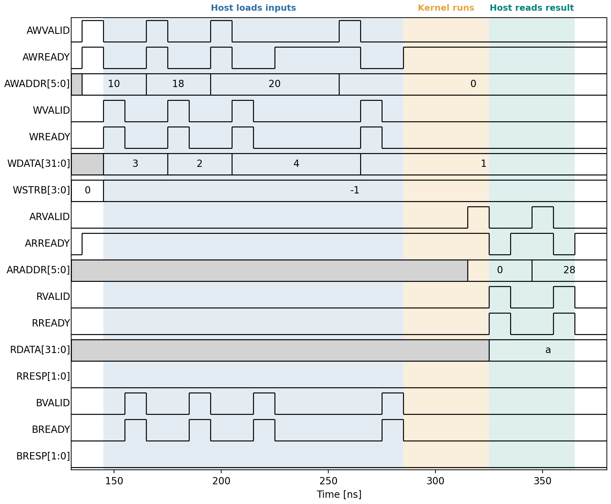
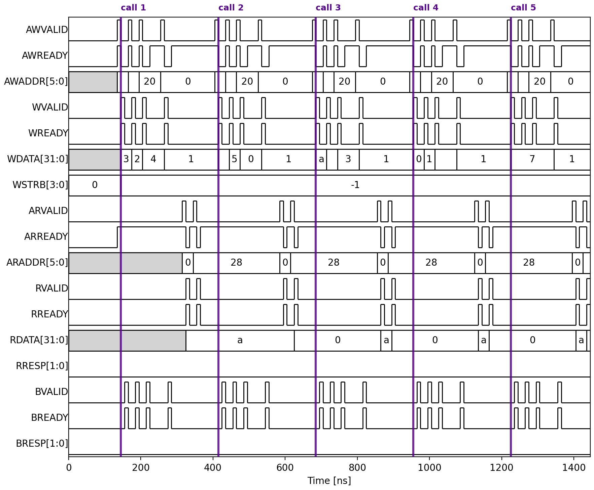

# The Execution Model

The previous page produced a timing diagram. This page reads it, and draws out
the pattern it shows — the **host-activated execution model**, which is how
every IP in this course is driven.

Everything below is measured from the co-simulation you just ran, not drawn by
hand. You can reproduce any of it.

## The five phases

For a host-activated kernel, one call looks like this:

1. **The host loads the inputs.** It writes each argument to its own register.
2. **The host starts the kernel.** It writes `1` to bit 0 of the control
   register at offset `0x00` — that bit is `ap_start`.
3. **The kernel runs** to completion. The processor is not involved.
4. **The kernel signals completion.** It sets `ap_done` in the control
   register, and can optionally raise an interrupt.
5. **The host retrieves the result**, by reading the output register.

Note what the processor does during step 3: it either polls the control
register or waits for an interrupt. It cannot do anything else with the IP,
because there is nothing else the IP will accept until it is done.

This model comes directly from one line of the source:

~~~c
#pragma HLS INTERFACE s_axilite port=return bundle=CTRL
~~~

`port=return` is what creates `ap_start` and `ap_done` and puts them in the
control register. Without it there would be no start/done handshake at all.

## One call, on the wire

~~~bash
(env) python scalar_fun_build.py --through timing_diagram
~~~

The shading is not decoration and it is not drawn by hand — the boundaries are
decoded from the trace, by finding every clock edge where a channel's `VALID`
and `READY` are both high:

* **Host loads inputs** (blue) — from the first write until the last write
  response comes back.
* **Kernel runs** (amber) — the gap in which the host has stopped writing and
  has not yet started reading.
* **Host reads result** (green) — from the first read address to the last read
  data.

One honest caveat about the amber band. It is the *host's* view — the window in
which the processor has nothing to do — not a measurement of the kernel. The
kernel's own latency is 5 cycles, and it has in fact already finished before
the host gets around to asking. There is no `ap_done` wire in this trace to
show the exact moment, because `ap_done` is a register bit, not a port.

Decoded, that is exactly the five phases:

| Time (ns) | Channel | Address | Data | Phase |
|---|---|---|---|---|
| 135 | write | `0x10` | `3` | load `x` |
| 165 | write | `0x18` | `2` | load `w` |
| 195 | write | `0x20` | `4` | load `b` |
| 255 | write | `0x00` | `1` | **start** (`ap_start`) |
| 315 | read | `0x00` | `0xa` | poll status — `ap_done` and `ap_ready` |
| 345 | read | `0x28` | `10` | retrieve `y` |

The status read returns `0xa` = `0b1010`: bit 1 is `ap_done`, bit 3 is
`ap_ready`. That is step 4 — the kernel reporting completion through a register
rather than through a wire, because `return` was bound to the AXI4‑Lite bundle.

**Four writes and two reads to compute one number.** Hold on to that.

### Where the offsets come from

`0x10`, `0x18`, `0x20`, `0x28` — why those? Vitis lays out an `s_axilite`
bundle to a fixed pattern, and you can read it straight out of the generated
register-map module, `scalar_fun_proj/solution1/syn/verilog/simp_fun_CTRL_s_axi.v`:

~~~text
// 0x00 : Control signals        (ap_start bit 0, ap_done bit 1)
// 0x04 : Global Interrupt Enable Register
// 0x08 : IP Interrupt Enable Register
// 0x0c : IP Interrupt Status Register
// 0x10 : Data signal of x
// 0x14 : reserved
// 0x18 : Data signal of w
// 0x1c : reserved
// 0x20 : Data signal of b
// 0x24 : reserved
// 0x28 : Data signal of y
// 0x2c : Control signal of y
~~~

Two things set the layout. A **control block** takes the first four registers,
which is why the arguments start at `0x10` rather than `0x04`. Then each
argument takes **two** 32-bit slots: one for the data and one that is reserved
— except for an output like `y`, where the second slot carries a valid bit.

The stride follows the argument's **width**, not a fixed spacing. A 64-bit
argument needs two slots for its data plus one for control, so it takes three:

~~~text
// 0x28 : Data signal of ll      (bits 31:0)
// 0x2c : Data signal of ll      (bits 63:32)
// 0x30 : reserved
~~~

The tool also leaves gaps that follow no rule you would want to rely on. So
the practical advice is the one real drivers follow: **never compute these
offsets by hand.** Vitis writes them into the generated driver header, and
that is what software should read.

## Five calls in a row

The vertical rules mark where each call begins, and they too are decoded rather
than placed by hand. The same shape, five times — once per test case. `AWADDR` cycles through
`0x10`, `0x18`, `0x20`, `0x00`; `ARADDR` alternates `0x00` and `0x28`. Nothing
overlaps: the next call cannot start loading until the previous one has been
read out.

Across the whole run there are exactly **20 write beats and 10 read beats** —
four writes and two reads per call, five calls. The bus does the same work
every time regardless of what the kernel computes.

## Reading the handshake

Look closely at any transfer and you will see the rule from the first half of
this unit:

* `VALID` is asserted by the sender, `READY` by the receiver.
* The transfer happens on the clock edge where **both** are high.
* Either side may wait for the other. Neither may withdraw once asserted.

Every one of the six transfers above obeys it, including the write response on
`BVALID`/`BREADY` that follows each write — which is easy to forget, because
nothing in the C++ suggests a write needs an acknowledgement.

## Measuring it yourself

The numbers in the table came from the VCD, not from reading the picture. You
can extract them the same way:

~~~python
from vcdvcd import VCDVCD

v = VCDVCD("vcd/dump.vcd", signals=None, store_tvs=True)
print(v.signals)          # every signal the trace contains
~~~

Find the clock's rising edges, then report every edge where a channel's `VALID`
and `READY` are both high. That is the whole of AXI4‑Lite transaction decoding,
and it is worth writing once, because it is how you will debug an interface
that is not behaving.

The demo's version is `axi_trace.py`, in about sixty lines:

~~~bash
(env) python -c "import axi_trace; print(len(axi_trace.decode('vcd/dump.vcd')))"
~~~

It contains one trap worth knowing about. Signals settle *after* a clock edge
and are read at the *next* one, and the simulator timestamps them a fraction of
a nanosecond late — so sampling exactly *at* the edge straddles the transition
and silently loses transfers. Sampling one picosecond *before* the edge reads
what the hardware sees. Getting this wrong found 16 of the 20 write-address
beats and gave no error at all.

---
Go to [Limitations](./limitations.md)
