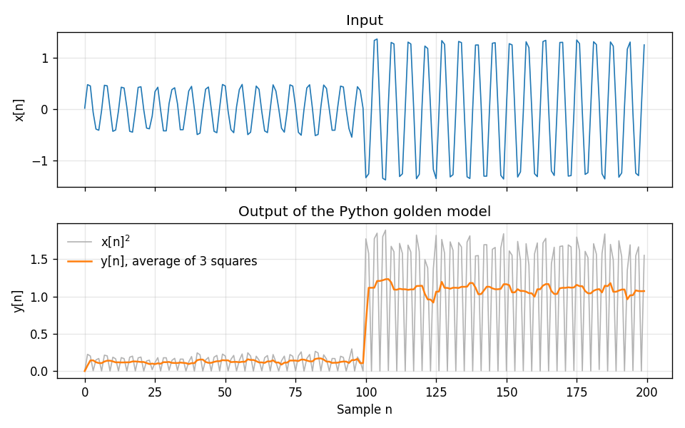

# The Python Golden Model

Before we build any hardware, we write the same filter in Python. This
**golden model** is the reference that the C++ kernel and the synthesized
RTL are both checked against. It also generates the **test vectors**: the
input signal the testbench feeds to the kernel.

## The build script

The demo runs from a build script, `avgfilt_build.py`, built on the
[waveflow build system](https://sdrangan.github.io/waveflow/docs/guide/build/).
It works exactly like the one in the
[scalar function demo](../procif/vitis_ip.md#the-build-script). The build
is a graph of **steps**. Each step declares the files it **consumes** and
**produces**, and the script works out the order. A step whose inputs have
not changed is skipped.

Open a terminal, activate the [virtual environment](../../support/repo/package.md)
that has `waveflow`, and go to the demo:

~~~bash
cd hwdesign/demos/stream/avgfilt
~~~

List the steps:

~~~bash
(env) python avgfilt_build.py --list-steps
~~~

~~~text
avgfilt_cpp
avgfilt_h
tb_avgfilt
run_tcl
golden_py
timing_py
pysim
plot_python
csim
verify_csim
csynth
cosim
verify_cosim
extract_vcd
timing_diagram
report
~~~

The first six are the hand-written source files. The rest do the work, in
this graph:

~~~text
pysim -> plot_python ------------------------------------------> report
      -> csim -> verify_csim -> csynth -> cosim -> verify_cosim -^
                                                -> extract_vcd -> timing_diagram -^
~~~

You run the graph up to a step with `--through`:

~~~bash
(env) python avgfilt_build.py --through <step>
~~~

This runs that step and everything it depends on, and nothing else. Other
useful options:

| Option | What it does |
| --- | --- |
| `--list-steps-verbose` | what each step consumes and produces |
| `--status` | which steps are out of date, without running anything |
| `--force-step <step>` | re-run one step even though nothing changed |
| `--force` | re-run everything |
| `--live-output` | show Vitis's output as it runs, instead of saving it to `results/<stage>/vitis.log` |
| `--nsamp N`, `--seed S` | change the length of the test signal, or its noise |
| `--trange T0 T1` | the time window, in ns, for the timing diagram |

A step re-runs when a **file** it depends on has changed, not when an
option has. So when you change `--nsamp`, `--seed`, `--trange` or
`--trace-level`, also force the step the option belongs to, with
`--force-step pysim`, `--force-step timing_diagram` or `--force-step cosim`
respectively. Everything downstream of it then re-runs by itself.

## The model

The model is in `avgfilt_golden.py`:

~~~python
def avgfilt(x: np.ndarray) -> np.ndarray:
    """The reference model.  The filter starts from zero state, as the kernel does."""
    x = np.asarray(x, dtype=np.float32)
    xsq = x * x
    # The two older squares, delayed by one and two samples, with zeros
    # shifted in -- the kernel's xsq0 and xsq1.
    xsq0 = np.concatenate([np.zeros(1, np.float32), xsq[:-1]])
    xsq1 = np.concatenate([np.zeros(2, np.float32), xsq[:-2]])
    inv_win_size = np.float32(1) / np.float32(WIN_SIZE)
    return ((xsq + xsq0) + xsq1) * inv_win_size
~~~

It does not loop sample by sample the way the kernel does. It computes the
whole signal at once with NumPy, building the delayed squares by shifting
the array. It is a genuinely different implementation of the same filter,
and that difference is what makes it a useful check.

Two details are deliberate:

* **It computes in `float32`**, the same precision as the kernel's `float`.
  NumPy would otherwise use 64-bit `float64`, and every output would differ
  slightly from the hardware's.
* **It adds in the same order as the kernel**: `(xsq + xsq0) + xsq1`, then
  multiplies by `1/3`. Floating-point addition is not associative, so a
  different order can change the last bit. Matching the order means a
  correct kernel reproduces the model **bit for bit**.

## The test signal

`test_signal()` makes a sinusoid whose amplitude steps from 0.5 to 1.5
halfway through, plus a little noise:

~~~python
amp = np.where(n < nsamp // 2, 0.5, 1.5)
x = amp * np.sin(2 * np.pi * n / 6) + 0.05 * rng.standard_normal(nsamp)
~~~

The frequency, 1/6 cycle per sample, is chosen for the filter. At that
frequency $\sin^2$ repeats every 3 samples, and the average of any 3
consecutive values of $A^2 \sin^2$ is exactly $A^2/2$. So the squared
input swings between 0 and $A^2$, but the filter's output should be flat
at $A^2/2$: 0.125 before the step and 1.125 after it.

## Step 1: Generate the vectors (`pysim`)

~~~bash
(env) python avgfilt_build.py --through pysim
~~~

~~~text
pysim:
    vectors\tv_python.csv
    RUNNING...
Wrote 200 samples to vectors\tv_python.csv
    PASSED
~~~

Open `vectors/tv_python.csv`. It has one row per sample, with columns
`n,x,y`: the sample index, the input and the golden output.

~~~text
n,x,y
0,0.0172792096,9.95236915e-05
1,0.474093616,0.0750211105
...
99,0.0166406799,0.106689408
100,-1.33160222,0.634767056
101,-1.25591588,1.11692202
~~~

Notice samples 100 and 101. The amplitude steps at sample 100, and the
output there is only partway to the new level, because the window still
holds samples from before the step.

The values are written with 9 significant digits. That is enough to
round-trip a `float32` exactly, so reading the file back in C++ or Python
recovers the exact bits the model computed.

## Step 2: Plot it (`plot_python`)

~~~bash
(env) python avgfilt_build.py --through plot_python
~~~

`pysim` is reported `UP-TO-DATE` this time and is skipped, since nothing it
depends on changed. The plot is written to `results/avgfilt_python.png`:

The top panel is the input. In the bottom panel, the gray trace is
$x[n]^2$, which swings from zero to $A^2$ every three samples. The orange
trace is the filter's output. It is nearly flat, at about 0.125 and then
about 1.125, as predicted. What little ripple remains comes from the noise.
The output measures the signal's **power**, which jumps by a factor of 9
when the amplitude triples.

Plotting the model before trusting it is a habit worth keeping. Every
later check compares the hardware against this model, so if the model is
wrong, the hardware will be "verified" against the wrong answer.

## Under the hood: the build step

Here is the whole `pysim` step:

~~~python
@dataclass(kw_only=True)
class PySimStep(BuildStep):
    """Generate the test signal and run it through the Python model."""

    description = "Write vectors/tv_python.csv: the test signal and the golden output."
    consumes = ["golden_py"]
    produces = {"py_vectors": Path("vectors/tv_python.csv")}
    params = {"nsamp": 200, "seed": 1}

    def run(self, config: BuildConfig, nsamp, seed, **_) -> dict:
        x = golden.test_signal(nsamp=nsamp, seed=seed)
        y = golden.avgfilt(x)
        path = golden.write_vectors(config.root_dir / "vectors" / "tv_python.csv", x, y)
        ...
        return {"py_vectors": path}
~~~

It **consumes** `golden_py`, the model's source file, so editing the model
makes this step stale. It **produces** `py_vectors`. Every later step that
needs the vectors, `plot_python`, `csim` and `cosim`, asks for
`py_vectors` by name rather than hard-coding the path. The **params**
`nsamp` and `seed` are what `--nsamp` and `--seed` set on the command line;
to use new values, add `--force-step pysim`, as described above.
See [Core Components](https://sdrangan.github.io/waveflow/docs/guide/build/corecomp.html)
for the full contract.

---

Go to [C Simulation](./csim.md)
