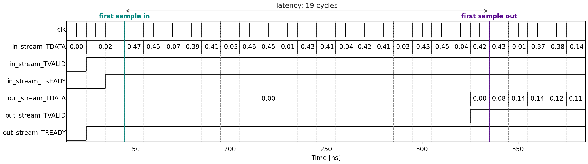
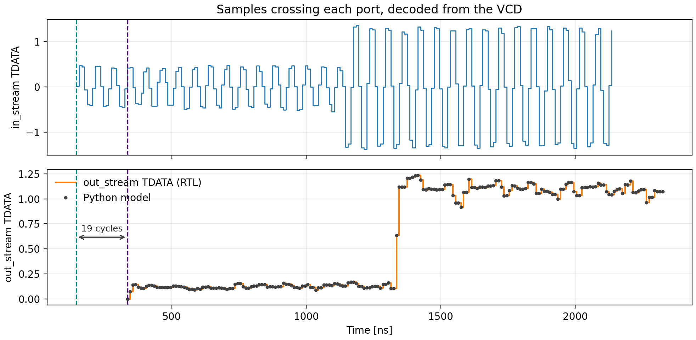

# Viewing the Timing Diagram

Co-simulation told us the RTL computes the right values. It did not show
*how* they moved: whether a sample crossed the port on every clock, how
long each one took to get through, whether the stream ever stalled. For
that we look at the waveforms of the ports themselves.

Run everything below from `hwdesign/demos/stream/avgfilt`, as before.

## Step 8: Extract a VCD file (`extract_vcd`)

Co-simulation records the waveforms in a `.wdb` (waveform database) file.
That is an AMD proprietary format that only the Vivado viewer opens. We
want a [**Value Change Dump**](https://en.wikipedia.org/wiki/Value_change_dump),
or **VCD**: an open text format that Python can read. Getting one means
re-running the RTL simulation with VCD logging switched on:

~~~bash
(env) python avgfilt_build.py --through extract_vcd
~~~

~~~text
extract_vcd:
    vcd\dump.vcd
    RUNNING...
VCD copied to ...\demos\stream\avgfilt\vcd\dump.vcd
VCD has 8 signals.
    PASSED
~~~

Eight signals, because co-simulation traced at **port** level: only the
IP's ports, not its internal registers. They are the whole interface we
saw in the [synthesis report](./rtlsim.md#the-interface):

~~~text
ap_clk
ap_rst_n
in_stream_TDATA [31:0]
in_stream_TVALID
in_stream_TREADY
out_stream_TDATA [31:0]
out_stream_TVALID
out_stream_TREADY
~~~

`vcd/dump.vcd` is plain text, so you can open it in an editor. After a
header declaring the signals, it lists the time of every change and the
new value of each signal that changed.

> **What the step does for you.** It finds the generated simulation
> directory, `avgfilt_proj/solution1/sim/verilog`, copies the simulator's
> TCL script, adds commands that open a VCD file and log the traced
> signals to it, re-runs the simulation, and copies the result to `vcd/`.
> This is the same step as in the
> [scalar function demo](../procif/rtlsim.md#extracting-a-vcd-file).

To trace every internal signal as well, pass `--trace-level all`, and
force co-simulation to run again, since the build only re-runs a step when
a *file* it depends on has changed, not an option:

~~~bash
(env) python avgfilt_build.py --through timing_diagram --trace-level all --force-step cosim
~~~

The VCD is then much larger.

## Step 9: Plot the streams (`timing_diagram`)

~~~bash
(env) python avgfilt_build.py --through timing_diagram
~~~

~~~text
timing_diagram:
    results\timing_diagram.png
    results\stream_data.png
    results\stream_timing.json
    RUNNING...
Latency 19 cycles; 200 samples out in 200 cycles; stalls in/out 0/0.
    PASSED
~~~

The step reads the VCD and **decodes** each stream. A sample crosses a
port on a rising clock edge where TVALID and TREADY are both high, so
walking the clock edges and keeping the TDATA value at each such edge
recovers every sample that crossed, and the time it crossed. TDATA is 32
bits of `float32`, so the step reads those bits as a float.

From that it writes two figures and a small report.

### The start of the stream

`results/timing_diagram.png` shows every port, cycle by cycle, from just
before the first sample goes in until just after the first sample comes
out:

Read it from left to right:

* **Before 125 ns** the simulation is in reset. Nothing is valid, and
  nothing is ready.
* **At 125 ns the testbench raises `in_stream_TVALID`** and puts the first
  sample, 0.02, on `in_stream_TDATA`. But `in_stream_TREADY` is still low:
  the IP is not yet accepting data. By the AXI4-Stream rule, the source
  must hold TDATA and TVALID steady until it is. So 0.02 sits on the bus.
* **At the 145 ns edge both TVALID and TREADY are high**, and the first
  sample transfers. From then on, TDATA changes on **every** clock edge,
  and TVALID and TREADY stay high: one sample transfers per cycle, with no
  gaps. That is the `II=1` from the synthesis report, visible on the
  wires.
* **`out_stream_TVALID` stays low for 19 cycles.** The first result is
  working its way through the multiplier and adders. `out_stream_TREADY`
  is high throughout, so the testbench is always ready to accept output.
* **At 325 ns `out_stream_TVALID` rises**, with the first output on
  `out_stream_TDATA`, and it transfers at the 335 ns edge. The next outputs
  follow one per cycle: 0.08, 0.14, 0.14, 0.12, ...

The arrow is the **latency**: 19 cycles from the first sample in to the
first sample out, which matches the iteration latency in the
[synthesis report](./rtlsim.md#the-pipeline). The report *estimated* it;
here it is *measured* on the RTL.

Latency and throughput are different things. The first result takes 19
cycles, but after that a new result appears every cycle, because 19
samples are in the pipeline at once.

To look at a different part of the run, give the window in ns. As with
any option, force the step to run again so it takes effect:

~~~bash
(env) python avgfilt_build.py --through timing_diagram --trange 1100 1350 --force-step timing_diagram
~~~

### The whole run

A waveform of 240 cycles is unreadable, with too many edges and labels to
tell apart. But the *values* that crossed each port are not.
`results/stream_data.png` plots them against the time they crossed:

The top panel is the input, exactly as it crossed `in_stream`. It is the
test signal from the [golden model](./python.md). The bottom panel is what
came out of `out_stream`, with the Python model's output drawn on top as
dots, at the time each RTL output appeared. They sit on each other,
shifted right by the 19-cycle latency.

Compare it with [the Python plot](./python.md#step-2-plot-it-plot_python):
it is the same filter, but now drawn from the hardware's own wires.

### The report

`results/stream_timing.json` has the measurements:

~~~json
{
  "clk_period_ns": 10.0,
  "nsamp": 200,
  "latency_cycles": 19,
  "output_cycles": 200,
  "stalls_in": 0,
  "stalls_out": 0,
  "input_matches_vectors": true,
  "output_matches_model": true
}
~~~

* **`output_cycles`: 200.** From the first output to the last took 200
  cycles for 200 samples: one per clock.
* **`stalls_in`, `stalls_out`: 0.** A stall is a cycle, once the stream
  has started, where TVALID or TREADY is low, so nothing moves. There are
  none.
* **`input_matches_vectors`, `output_matches_model`: true.** The samples
  decoded from TDATA are bit for bit the test vector going in and the
  Python model's output coming out. This is a third comparison against the
  model. It reads the values off the wires rather than out of the
  testbench's file, and the step fails if either one is false.

### The extra beats at the end

If you look at the end of the VCD, you will find more transfers than
samples: the testbench keeps `in_stream_TVALID` high after the 200th
sample, and feeds the RTL some extra beats of meaningless data until it
has collected all 200 outputs. The IP has no way to know the stream has
ended, since pure streaming has no TLAST. So the step keeps the first 200
transfers on each port and ignores the rest.

### Under the hood: the build step

The decoding and plotting live in `avgfilt_timing.py`. The step wires them
into the graph:

~~~python
@dataclass(kw_only=True)
class TimingDiagramStep(BuildStep):
    consumes = ["vcd", "py_vectors", "timing_py"]
    produces = {
        "timing_diagram": Path("results/timing_diagram.png"),
        "stream_data_plot": Path("results/stream_data.png"),
        "stream_timing": Path("results/stream_timing.json"),
    }
    params = {"trange": None}
~~~

It consumes the VCD, the golden vectors, which it checks the decoded data
against, and its own source file, so editing the plotting code re-plots
without re-simulating. The zoom window is computed from the decoded trace
rather than typed in, so it stays right if the latency changes.

The decoding uses waveflow's
[`VcdParser`](https://sdrangan.github.io/waveflow/): `add_axiss_signals`
finds the TDATA/TVALID/TREADY triple for each stream, and
`extract_axis_bursts` walks the clock edges and returns the transfers.

## Running the whole flow

Every step, in one command:

~~~bash
(env) python avgfilt_build.py
~~~

With no `--through`, the build runs through `report`, which depends on
everything else. It ends with a summary, also saved to
`results/summary.json`:

~~~json
{
  "top": "avgfilt",
  "nsamp": 200,
  "csim_verified": true,
  "csim_max_abs_err": 0.0,
  "cosim_verified": true,
  "cosim_max_abs_err": 0.0,
  "latency_cycles": 19,
  "output_cycles": 200,
  "stalls": 0,
  "python_plot": "results/avgfilt_python.png"
}
~~~

If you ran the steps one at a time, this returns almost immediately:
every step is `UP-TO-DATE`. To see what would re-run without running it,
use `--status`.

## What the build produced

| File | Step | What it is |
| --- | --- | --- |
| `vectors/tv_python.csv` | `pysim` | the test signal and the golden output |
| `results/avgfilt_python.png` | `plot_python` | plot of the input and the golden output |
| `vectors/tv_csim.csv` | `csim` | what the C++ kernel computed |
| `results/verify_csim.json` | `verify_csim` | C++ vs the model |
| `results/csynth/avgfilt_csynth.rpt` | `csynth` | the synthesis report |
| `vectors/tv_cosim.csv` | `cosim` | what the RTL computed |
| `results/verify_cosim.json` | `verify_cosim` | RTL vs the model |
| `vcd/dump.vcd` | `extract_vcd` | the ports' waveforms, in an open format |
| `results/timing_diagram.png` | `timing_diagram` | the ports, cycle by cycle, at the start of the stream |
| `results/stream_data.png` | `timing_diagram` | the values on each port over the whole run |
| `results/stream_timing.json` | `timing_diagram` | latency, throughput and stalls |
| `results/summary.json` | `report` | the verdicts and the timing in one place |
| `results/<stage>/vitis.log` | `csim`, `csynth`, `cosim` | the full Vitis output |

All of it is regenerated by the build and ignored by git. Delete
`vectors/`, `results/`, `vcd/` and `avgfilt_proj/` to start from scratch.

## When a step fails

* **`Vitis HLS stage 'csim' failed`, with `: error:` lines.** A compile
  error. The lines name the file and line.
* **`... failed`, with `FAIL` lines.** The testbench's own check failed.
  The lines name the samples.
* **`verify_csim` or `verify_cosim` failed.** The testbench passed, but the
  output disagrees with the Python model. The message names the first
  sample that differs. Either the kernel and testbench share a mistake, or
  the model is wrong. Check the plot.
* **`extract_vcd`: the VCD declares no signals.** Co-simulation recorded
  nothing to replay. Check that it ran with `--trace-level port` or `all`.
* **`timing_diagram`: the samples differ.** The values on the wires are
  not the test vector or the model's output, even though `verify_cosim`
  passed. Look at the timing diagram for where the stream goes wrong.
* **Vitis cannot be found.** See the [Vitis set-up](../../support/amd/).
* **Anything else.** Re-run with `--live-output` to see Vitis's output as
  it happens, or open `results/<stage>/vitis.log`.
