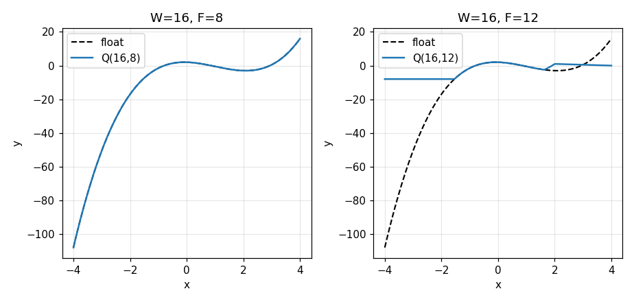

# Unit 3 Lab: A Cubic Polynomial in Fixed Point

## Overview

In this lab you'll implement a monic cubic polynomial

```python
    y = x**3 + a2*x**2 + a1*x + a0
```

in **fixed point** — first in Python, then in SystemVerilog — and find out what
that costs. Floating-point hardware is large, slow and power-hungry, so signal
processing blocks, control loops and accelerators overwhelmingly compute on
integers with an implied binary point. The arithmetic is cheap. The design work
is deciding where that point goes, and what to do when a value will not fit.

The lab makes that decision visible by running the same polynomial at two
settings, both sixteen bits wide: `Q(16,8)` and `Q(16,12)`. Four bits of
fraction are traded for four bits of range. At `Q(16,8)` the fixed-point curve
lies on the floating-point one. At `Q(16,12)` the cubic term runs off the end of
the register and the curve flattens into a plateau:



Same width. Same inputs. The only difference is where the binary point sits.
**More fractional bits is not better**, and that is the lesson worth taking away.

## Learning Objectives

In going through the lab, you will learn how to:

* Implement a **fixed-point** version of a nonlinear function in Python, as a
  **golden model**
* Handle **overflow** deliberately — saturation rather than wraparound — and see
  where each one leaves you
* **Measure** the quantization error the format costs, before any hardware exists
* Implement the same arithmetic in SystemVerilog as a **pipeline**
* **Verify** the RTL against the golden model *bit-exactly*, including on the
  cases that overflow

That last point is the one that makes this lab harder than it looks. It is not
enough for the hardware to be approximately right: it has to round the same way
and clamp in the same places as your Python, case for case. An off-by-one in a
shift is a few hundred disagreeing cases, and a missing saturation is a handful
that only show up at `Q(16,12)`.

## Files

The files for the lab can be found in the hwdesign github repo

```
hwdesign/
└── labs/
    └── cubic/
        ├── cubic_build.py          # Runs the build steps and scores them
        ├── tb_cubic.sv             # Testbench that drives the module
        ├── partial/
        │   ├── cubic_model.py      # Python golden model
        │   ├── cubic_eval.py       # Your measurements of its error
        │   ├── cubic.sv            # SystemVerilog module: the pipeline
        │   └── tb_cubic_sing.sv    # One-case testbench, for debugging
        ├── vectors/                # These directories are created by the build
        ├── results/                #   generated data, figures, scores and
        ├── eval/                   #   simulator output -- none of it is edited
        ├── sim/                    #   by hand, and none of it is submitted
        └── submission/             #   except the zip
```

The four files in the `partial` directory are not complete. You will finish them
as part of the lab, and each has `TODO` comments marking what to write:

| File | What you write |
| --- | --- |
| `cubic_model.py` | `cubic_fixed()` — the polynomial on integers, with a saturation after every product |
| `cubic_eval.py` | `rel_mse()`, `mse_by_fbits()` and `plot_fixed_vs_float()` — the measurements you use to judge your own design |
| `cubic.sv` | The `always_comb` arithmetic and the `always_ff` that registers the pipeline |
| `tb_cubic_sing.sv` | `expected_y()` — what you believe your design computes for one case. Not graded; see [debugging one case](./sim_sing.md) |

`tb_cubic.sv` is given whole. Unlike the [Unit 1](../prng/) and
[Unit 2](../subc/) labs, there is no handshake to implement here: the module
presents its answer a fixed number of clocks after its inputs, so the testbench
is file reading and a `repeat`. Everything worth writing is in `cubic.sv`.

**You do not need to copy anything by hand.** The first time you run the build it
copies each file out of `partial/` into the lab directory and tells you it has
done so:

```
cubic_model_src:
    STARTED cubic_model.py from partial\cubic_model.py — edit cubic_model.py,
    not the copy in partial/.
pysim:
    Python fixed-point model: 0/10
      · (0/10) not started — cubic_model.py is still unchanged from the template.
          Open it, look for the TODO comments, and run this again.
```

A stage whose files you have not touched yet says **not started** rather than
listing failed checks. That is not the same as getting it wrong, and the build
does not pretend otherwise — you will see real check-by-check feedback as soon as
there is real work to check.

Edit the copies at the top level, *not* the ones in `partial/`. The build never
overwrites your work once the top-level files exist — not even with `--force` —
which is what keeps a `git pull`, or a stray rebuild, from destroying an
afternoon.

`cubic_build.py` is given and should not be modified. It is worth reading: it is
the script that decides your score, so nothing about the marking is hidden from
you.

## Build steps

So that the lab can be run incrementally, it uses the Waveflow package's
[Build DAG](https://sdrangan.github.io/waveflow/docs/guide/build/). The lab runs
as three *build steps*. In each one you complete one part of the design and then
run that step, which scores it and tells you why. You can edit and re-run as many
times as you like until you get a perfect score. A final step builds the
submission for Gradescope.

| Stage | Command | What it asks |
| --- | --- | --- |
| `pysim` | `python cubic_build.py --through pysim` | Does your Python cubic stay inside its registers, and still track the float where it should? |
| `pyeval` | `python cubic_build.py --through pyeval` | How much did the format cost — and does moving the binary point do what the theory says? |
| `svsim` | `python cubic_build.py --through svsim` | Does your SystemVerilog agree with your Python, case for case, saturation included? |
| `submit` | `python cubic_build.py --through submit` | Collects the three scores and builds the Gradescope zip |

There is a fourth step, `svsing`, which is **not graded** and not part of the
submission. It runs a single case you choose and prints the pipeline registers
cycle by cycle — the thing you want when `svsim` reports that two hundred cases
disagree and you need to look at one. See [debugging one case](./sim_sing.md).

Importantly, observe that you measure the design in Python **before** you build
it in hardware. That is not busywork and it is not the order most people reach
for; see [Measuring the error](./evaluate.md).

The full set of commands:

```bash
python cubic_build.py --list-steps-verbose   # what the stages are
python cubic_build.py --through pysim        # the fixed-point model, scored
python cubic_build.py --through pyeval       # measure what it cost, scored
python cubic_build.py --through svsim        # the SystemVerilog, scored
python cubic_build.py                        # everything, then the submission zip
python cubic_build.py --grades               # your scores, without rebuilding
python cubic_build.py --through svsing       # one case, with the registers on show
```

Each stage prints its score and the reason for it as soon as it runs. A low score
does not stop the build — you can keep going to the next stage and come back, and
you can re-run a stage as many times as you like.

The build only redoes what changed. Edit `cubic_model.py` and every stage re-runs,
because they all work from its output; edit only `cubic.sv` and just the
simulation does. Change nothing and each stage reports `UP-TO-DATE` and does no
work at all.

## Pages

* [The Python model](./python.md)
* [Measuring the error](./evaluate.md)
* [The SystemVerilog](./sv.md)
* [Debugging one case](./sim_sing.md)
* [Grading and submission](./submit.md)

This lab follows closely the [fixed point demo](../../demos/fixp/), which works
the same steps through a piecewise linear function. If any of the fixed-point
notation below is unfamiliar, read that first.

----

Go to [the Python model](./python.md).
