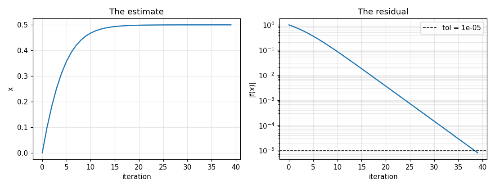

# Stage 1: The golden model

Before writing any C++, you build the solver in Python, where debugging is
cheap. This model is the **golden model**: in [stage 2](./vectors.md) it
produces the answers the hardware is checked against, so it has to be right
before anything else is worth doing.

## The algorithm, precisely

```
x  = x0
fx = f(x)
repeat until |fx| < tol, or max_iter updates have been made:
    x  = x - step * fx
    fx = f(x)
```

and return `x`, `fx` and `niter`, the number of updates made. Three details of
this are part of the specification, because the kernel has to do exactly the
same and the lab checks that it does:

* **`fx` is always `f(x)` at the returned `x`** — not the value from before the
  last update. Update `x` and return the old `fx`, and your root estimate and
  its residual describe two different points.
* **`niter` counts updates.** If `x0` is already a root, the loop body never
  runs and `niter` is 0. If the loop runs out, `niter` is `max_iter`.
* **It stops at the first `x` with `|f(x)| < tol`.** Test the condition
  *before* each update. One more update would still be a root, but not the one
  the kernel returns, and every vector would then disagree by one.

## Single precision

Everything is computed in `np.float32`, because that is what the kernel computes
in. A model in `float64` would be *more* accurate than the hardware, and the
difference would show up in [stage 4](./evaluate.md) as a mismatch that is
nobody's bug.

This is easy to get wrong silently: one `float64` anywhere in the update promotes
the whole expression to `float64`. `fsolve()` converts every input to
`np.float32` before the loop for exactly this reason — keep it that way.

The polynomial itself is given, as `fcubic()`:

```python
x2 = x * x
x3 = x2 * x
fx = a0 + a1*x + a2*x2 + x3      # added left to right
```

The order is deliberate. Floating-point addition is not associative —
`(a + b) + c` and `a + (b + c)` can differ in the last bit — so evaluate the
polynomial in this same order in C++ and the two can agree *exactly*.

## Why it converges

If `f` is increasing, the update always moves `x` toward the root. A monic cubic
is increasing everywhere exactly when its derivative `3x² + 2·a2·x + a1` has no
real root, which is when

```
a1 > a2² / 3
```

You will need this in [stage 2](./vectors.md), when you draw random problems.
The old version of this lab said "`a1, a2 ≥ 0`", which is not enough:
`a1 = 0, a2 = 1` gives `f'(x) = 3x² + 2x`, negative between `-2/3` and `0`.

## What to write

In `fsolve.py`:

| Function | What it does |
| --- | --- |
| `fsolve(a0, a1, a2, x0, tol, max_iter, step)` | The loop above. Returns `(x, fx, niter, hist)` |
| `plot_convergence(hist, tol, out_path)` | Draws one run and saves it to `out_path` |

`hist` is a dictionary `{"x": [...], "fx": [...]}` holding every `x` visited and
`f` at it, **starting with `x0`** — so both lists have `niter + 1` entries, and
the last ones are the `x` and `fx` you return.

`plot_convergence` draws two subplots against the iteration number: `x`, and
`|f(x)|` on a **log** scale with `tol` marked as a horizontal line.



Plot the residual on a linear axis and the last thirty iterations are a flat
line on the floor. On a log axis they are a straight slope, and the slope *is*
the convergence rate: `|f|` shrinks by a constant factor per update, which is
what this iteration does near a root.

## Running the stage

```bash
python rootsolve_build.py --through pysim
```

The build runs your `fsolve()` on twenty problems of its own, drawn from the same
family as your test vectors will be:

```
The golden model converges: 10/10
  ✓ (1/1) fsolve returned (x, fx, niter, hist) for all 20 cases
  ✓ (3/3) |f(x)| < tol = 1e-05 at the x returned
  ✓ (2/2) Every update is x - step*f(x), recorded in hist
  ✓ (1/1) It stops at the first x with |f(x)| < tol
  ✓ (1/1) It stops after max_iter updates when it has not converged
  ✓ (2/2) You produced a convergence figure
    figure written to results\fsolve_hist.png
```

What each check looks at:

* **Converged** re-evaluates `f` at the `x` you returned, in double precision,
  rather than trusting the `fx` you reported. Both have to be below `tol`.
* **The update rule** is checked from `hist`: that it starts at `x0`, that every
  `fx` is `f` at the `x` beside it, and that every `x` is the previous one moved
  by `step * fx`. This is why `hist` has to include `x0`.
* **Stops at the first** looks for an entry in `hist` before the last that was
  already below `tol`.
* **Stops after `max_iter`** runs one problem with `max_iter = 5`, far too few
  to converge, and expects `niter = 5` back.

The figure is the problem at the top of this page, and only its existence is
scored. It goes into your submission, where a person can look at it.

A quick check while you work — run the file directly:

```bash
python fsolve.py
```

```
  root x = 0.4999970   f(x) = -8.099e-06   after 39 updates
```

followed by five test vectors, once you have written `make_vectors()` in
[stage 2](./vectors.md).

----

Go to [the test vectors](./vectors.md).
