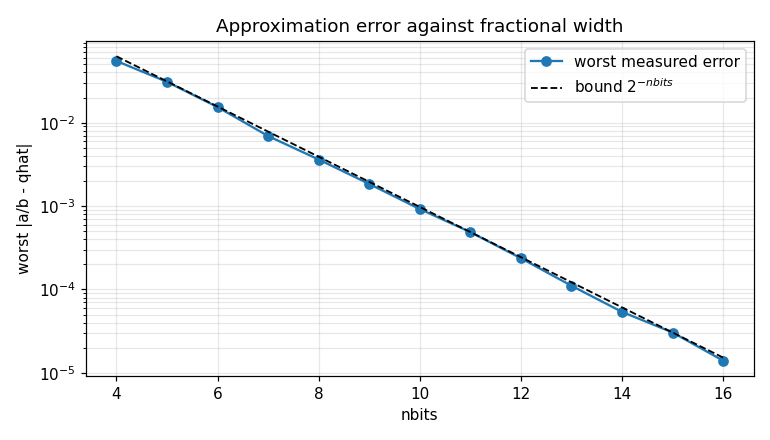

# Stage 2: Measuring the error, before you build anything

## Why this stage exists

You have a divider that returns numbers. Is it right?

"It ran without crashing" is not an answer, and neither is "it looked right on one
example". The way you answer it is to **measure** the approximation error across
many cases — in Python, where measuring is cheap, and *before* you write a line of
SystemVerilog.

That ordering is the point of this stage, and it is not the order most people
reach for. The temptation is to get the hardware going and debug it there. But a
flaw you find here costs you an edit; the same flaw found after you have a state
machine costs you a day of staring at waveforms, and you will spend most of that
day wondering whether the bug is in the hardware when it was in the algorithm all
along.

So: a golden model is not just something to compare hardware against. It is where
you find out whether the design is worth building.

## Two claims, measured separately

The [theory](./theory.md#the-error-bound) promises two different things, and it is
worth keeping them apart:

**The error is bounded** — `a/b - qhat < 2**-nbits`, so every extra bit halves the
worst case. On a logarithmic axis that is a straight line, and seeing it come out
straight is how you know the algorithm converges at the rate it should rather than
merely being "close enough" on the cases you tried.

**The error is one-sided** — `qhat` never exceeds `a/b`. A divider that rounded to
nearest would have a *smaller* absolute error and would still be wrong for this
lab, because the rest of a design is entitled to assume the quotient is an
under-estimate. A measurement that throws away the sign cannot tell the two apart.

That second point is why `quant_error()` returns a **signed** value.

## What to write

Three functions in `subc_eval.py`:

| Function | Returns |
| --- | --- |
| `quant_error(a, b, z, nbits)` | The signed error `a/b - z/2**nbits`, one per case |
| `max_error_by_nbits(nbits, err)` | `(widths, worst)` — the distinct `nbits` in increasing order, and the largest `|err|` at each |
| `plot_error(widths, worst, out_path)` | Saves the figure below to `out_path` |

Two things reliably catch people out in `quant_error`:

* `a`, `b` and `z` are **integer** arrays. Convert to float before dividing, or
  numpy does integer division and hands you zeros.
* `nbits` is an **array**, one entry per case, not a single number. Write the
  expression elementwise and numpy pairs each `z` with its own `nbits`.

In `max_error_by_nbits`, take the *worst* case at each width rather than the
average. The bound is a promise about every case, so a single case that breaks it
matters and an average would hide it.

## The figure

`plot_error` draws worst-case error against `nbits`, with the `2**-nbits` bound
alongside it for comparison:



A log y-axis is what makes this legible — the bound is a straight line on it, so a
divider converging at the right rate runs parallel to it, and one that does not is
obvious at a glance.

One practical note: a worst case of exactly zero cannot be drawn on a log axis.
Clamp it (`np.maximum(worst, 1e-18)`) so that an unimplemented divider produces a
figure rather than an exception.

## Running the stage

```bash
python subc_build.py --through pyeval
```

```
Measuring the error: 10/10
  ✓ (3/3) Your quant_error is correct
  ✓ (3/3) Your per-nbits worst case is correct
  ✓ (2/2) The error is one-sided and below 2**-nbits
  ✓ (2/2) You produced an error-vs-nbits figure
```

Notice what the first two checks and the third are doing. The first two ask
**can you measure it** — your numbers against the true ones. The third asks
**is the design any good** — and it is scored from the true errors, not from
yours, so a broken measurement costs you the measurement marks without also
condemning a divider that was fine.

A correct measurement of a bad divider earns the first and not the third. That
distinction is the thing this stage exists to teach.

Only the *existence* of the figure is scored. Judging a plot mechanically is a
poor trade — the checks that could be automated are the ones you can satisfy
without drawing anything worth looking at — so the file goes into your submission
instead, where a person can read it.

----

Go to [building a SystemVerilog module](./sv.md).
